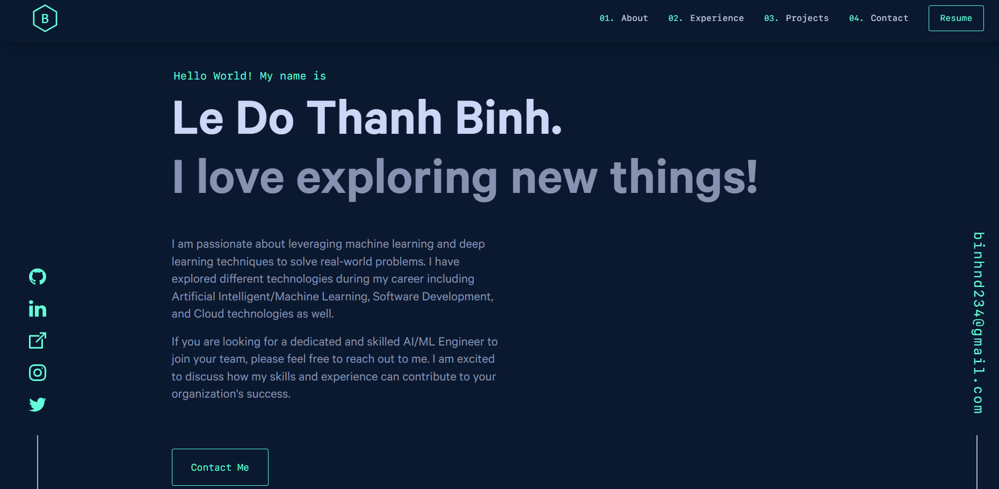

<div align="center">
  
</div>
<h1 align="center">
  Portfolio Website Version 1
</h1>
<p align="center">
  The first iteration of <a href="https://binh234.github.io/" target="_blank">binh234.github.io</a> built with <a href="https://www.gatsbyjs.org/" target="_blank">Gatsby</a> and hosted with <a href="https://pages.github.com/" target="_blank">Github Pages</a>
</p>

<div align="center">
  
</div>

### About this repo
This is an update version of [https://github.com/bchiang7/v4](https://github.com/bchiang7/v4), React is updated to version 18 and Gatsby to version 5.

### 🚨 Forking this repo (please read!)

Yes, you can fork this repo. Please give proper credit by linking back to [brittanychiang.com](https://brittanychiang.com). Thanks!

To make your own portfolio website, follows these steps:

1. Change logo inside `src/components/icons/loader.js` and `src/components/icons/logo.js`
2. Modify every things inside `content` folder to your own
3. Update `resume` inside `static` folder
4. Follow `Steps-to-deploy.md` to deploy on github pages

## 🛠 Installation & Set Up

1. Install and use the correct version of Node using [NVM](https://github.com/nvm-sh/nvm) (Node version 18 or above)

   ```sh
   nvm install
   ```

2. Install the Gatsby CLI

   ```sh
   npm install -g gatsby-cli
   ```

3. Install dependencies

   ```sh
   npm install
   ```

4. Start the development server

   ```sh
   npm start
   ```

5. Go to [localhost:8000](http://localhost:8000)
## 🚀 Building and Running for Production

1. Generate a full static production build

   ```sh
   npm run build
   ```

1. Preview the site as it will appear once deployed

   ```sh
   npm run serve
   ```

## 🎨 Color Reference

| Color          | Hex                                                                |
| -------------- | ------------------------------------------------------------------ |
| Navy           |  `#0a192f` |
| Light Navy     |  `#172a45` |
| Lightest Navy  |  `#303C55` |
| Slate          |  `#8892b0` |
| Light Slate    |  `#a8b2d1` |
| Lightest Slate |  `#ccd6f6` |
| White          |  `#e6f1ff` |
| Green          |  `#64ffda` |
